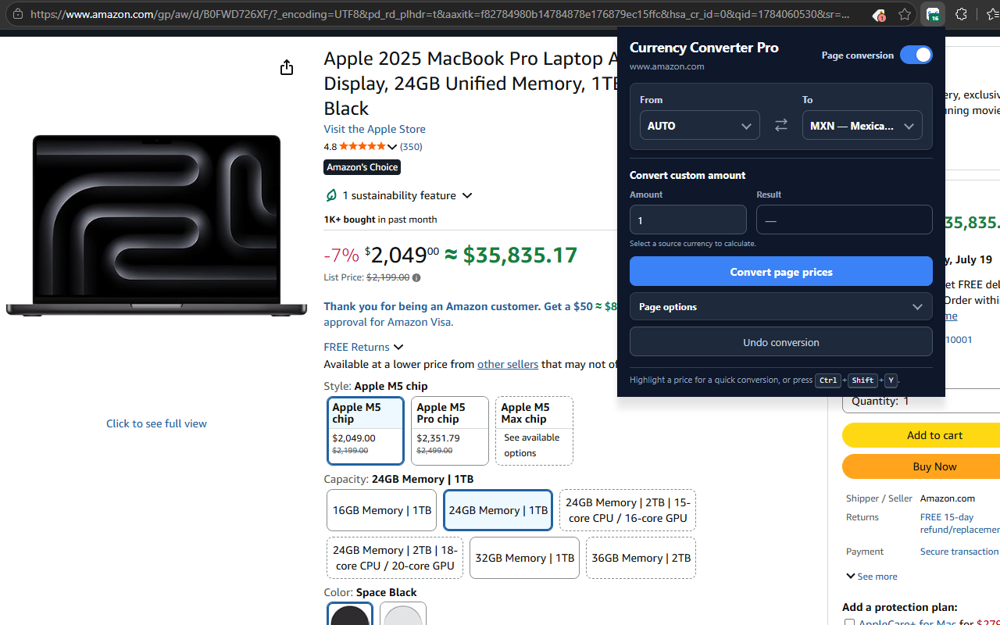
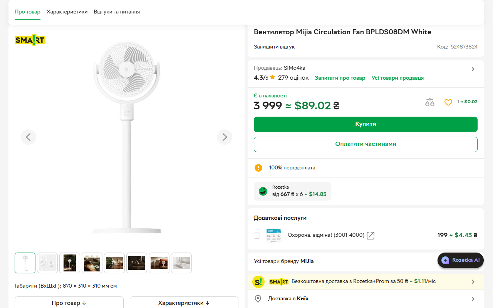

# 💱 Currency Converter Pro

Currency Converter Pro is a privacy-focused Chrome and Firefox extension that converts prices on shopping pages into a currency you understand.

**Current version:** 1.6.0 · **Platforms:** Chrome and Firefox Manifest V3 · **License:** MIT

[](https://chromewebstore.google.com/detail/currency-converter-pro/mocmiipnkiobjgjkfehpcmlapgjaepfk) [](https://addons.mozilla.org/en-US/firefox/addon/currencyconverterpro/) · [📦 Chrome build](release/1.6.0/currency-converter-pro-1.6.0-chrome.zip) · [📦 Firefox build](release/1.6.0/currency-converter-pro-1.6.0-firefox.zip) · [🔒 Privacy policy](privacy-policy.md)

**[View the complete changelog →](CHANGELOG.md)**

## 📸 Screenshots

| Current popup and page conversion | Converted price on a shopping page |
| --- | --- |
|  |  |

## Features

- Search currencies by name or ISO code, with conservative **AUTO** detection when the source currency is unknown.
- Convert a complete shopping page, one highlighted price, or an amount typed into the popup.
- Handle prices added later by dynamic and single-page websites.
- Show converted prices beside the originals or replace them, with exact undo support.
- Remember only websites you explicitly approve and support a keyboard conversion shortcut.
- Continue temporarily with clearly labeled cached rates when the provider is unavailable.

## Installation

- **Store installation:** Install Currency Converter Pro from the [Chrome Web Store](https://chromewebstore.google.com/detail/currency-converter-pro/mocmiipnkiobjgjkfehpcmlapgjaepfk) or [Firefox Add-ons](https://addons.mozilla.org/en-US/firefox/addon/currencyconverterpro/).
- **Manual installation:** Download the latest [Chrome build](release/1.6.0/currency-converter-pro-1.6.0-chrome.zip) or [Firefox build](release/1.6.0/currency-converter-pro-1.6.0-firefox.zip), extract it, and load it through the browser's extension-development page. The Firefox build requires Mozilla signing for permanent installation.

## 🧭 How to use it

### Convert an entire page

1. Open the extension from the browser toolbar.
2. Turn on **Page conversion**.
3. Keep **AUTO** selected, or search for a source currency manually.
4. Search for and select the currency you want to see.
5. Select **Convert page prices**.
6. Use **Undo conversion** to restore the original page.

### Convert a custom amount

Enter a value under **Convert custom amount**. The popup calculates the result without needing to inspect the current webpage.

### Convert one highlighted price

Highlight a supported price on the page and use the small conversion prompt or the **Convert selected currency** right-click action.

### Remember a website

Open **Page options** and enable **Always convert this website**. The browser grants access only to that website. Use **Forget site** to revoke the permission later.

## ⚙️ How it works

1. **Local detection:** the extension checks visible price text, structured product metadata, currency codes, symbols, and page context inside the browser.
2. **Conservative matching:** ambiguous symbols such as `$`, `¥`, and `kr` are converted only when the page provides enough currency context.
3. **Rate lookup:** only ISO currency codes are sent to the public [Frankfurter API](https://frankfurter.dev/) to request reference exchange rates.
4. **Local rendering:** converted values are inserted beside the original prices or replace them according to the selected display mode.
5. **Dynamic updates:** bounded background scans handle prices that appear after the initial page load without continuously rescanning the entire document.

## 🎯 Currency detection confidence

AUTO detection gives every supported currency a weighted score based on evidence found on the page:

$$
S(c)=100M+100J+75E+\min(30,10V)+20D+40K+15L
$$

| Signal | Meaning | Weight |
| --- | --- | ---: |
| $M$ | Matching structured price metadata | 100 per match |
| $J$ | Matching JSON-LD `priceCurrency` | 100 per match |
| $E$ | Matching currency in embedded shop data | 75 per match |
| $V$ | Visible ISO currency-code occurrences | 10 each, up to 30 |
| $D$ | Matching country-code domain | 20 |
| $K$ | Matching canonical country-code domain | 40 |
| $L$ | Matching page language or region | 15 |

The currency with the highest score becomes the AUTO candidate. The runner-up score is also considered so that two competing currencies do not produce a misleadingly confident result.

- **High confidence:** the winning score is at least 70 and at least 20 points above second place.
- **Medium confidence:** the winning score is at least 30 and at least 10 points above second place.
- **Low confidence:** the evidence does not meet either threshold, so page conversion asks for a manually selected source currency.

These values are heuristic confidence scores, not statistically calibrated probabilities. A probability-like estimate can be produced with an unknown-currency baseline:

$$
P(c)=\frac{e^{S(c)/T}}{e^{U/T}+\sum_k e^{S(k)/T}}
$$

Suggested starting parameters are $T=20$, which controls how strongly score differences affect the result, and $U=30$, which represents **currency unknown**. The output should be described as a **detection confidence estimate** until it has been calibrated against a large labeled collection of real webpages.

For example, if JSON-LD identifies EUR, the page uses a `.de` domain, and its language is `de-DE`, EUR receives $100+20+15=135$ points. If USD appears only twice as visible text, USD receives 20 points. With the suggested parameters, the resulting EUR confidence estimate is approximately 99%.

## 🔐 Privacy and permissions

All webpage scanning, price detection, conversion, and rendering happen locally inside the browser. The extension never transmits page contents, highlighted text, price values, visited URLs, or browsing history.

The only external requests retrieve the currency catalog and reference rates from Frankfurter using ISO currency codes. No webpage text, prices, URLs, analytics, tracking identifiers, or advertising data is included. As with any HTTPS request, the service may receive ordinary network metadata such as an IP address. Preferences, recent currency choices, cached rates, and deliberately approved website origins remain in browser storage.

| Permission | Why it is needed |
| --- | --- |
| `storage` | Saves settings, recent currencies, approved website origins, and cached rates. |
| `contextMenus` | Adds the right-click command for a highlighted price. |
| `activeTab` and `scripting` | Temporarily reads and updates the current page after a user action. |
| Optional website access | Enables automatic conversion only on websites the user explicitly remembers. |
| `api.frankfurter.dev` | Retrieves reference exchange rates using ISO currency codes. |
| Firefox `websiteContent` data declaration | Discloses that a source ISO currency code detected from the page can be transmitted to the rate provider; raw page text, prices, and URLs are not transmitted. |

Read the complete [privacy policy](privacy-policy.md) for retention, deletion, and provider details.

## 🌍 Currency behavior

- Manual selection uses the exchange-rate provider's current active currency catalog.
- AUTO detection uses a curated set of currencies to reduce false positives.
- Structured product data and explicit ISO currency codes receive the strongest detection priority.
- Stock counts, dates, ratings, product model numbers, hidden content, and editable fields are excluded.
- Recently used currencies are shown first.
- Currency-native precision is respected, including zero-decimal JPY and three-decimal KWD.

## ⚠️ Limitations

- Prices inside images, closed shadow roots, and inaccessible cross-origin frames cannot be converted.
- Some unusual or heavily scripted price layouts may need a manually selected source currency.
- Cached rates warn after 48 hours and are never used after seven days.
- Rates are intended for convenient price comparison and may differ from bank or card-provider rates.

## 🛠️ Building a release

Windows PowerShell:

```powershell
powershell -ExecutionPolicy Bypass -File .\scripts\build-release.ps1
```

macOS or Linux:

```bash
sh ./scripts/build-release.sh
```

Or build either target directly:

```bash
npm run build:chrome
npm run build:firefox
```

The build composes `manifests/base.json` with the selected browser override, copies only `src/` runtime assets into `dist/<browser>/`, and writes upload-ready ZIP archives to `release/<version>/`. Tests, reports, documentation, source manifests, and development files are excluded from both packages.

## 📦 Recent releases

| Version | Highlights | Download |
| --- | --- | --- |
| 1.6.0 | Shared Chrome/Firefox source, browser-specific manifests, dual builds, and Firefox validation | [Chrome](release/1.6.0/currency-converter-pro-1.6.0-chrome.zip) · [Firefox](release/1.6.0/currency-converter-pro-1.6.0-firefox.zip) |
| 1.5.1 | Searchable currency selectors, refined dropdown styling, accessible animations, and a stable Page options reveal | [Chrome](release/1.5.1/currency-converter-1.5.1-chrome-store.zip) |
| 1.5.0 | Quick amount converter, remembered websites, dynamic-page support, display modes, provider catalog, and resilient rate caching | [Chrome](release/1.5.0/currency-converter-1.5.0-chrome-store.zip) |
| 1.4.2 | Clean Store package with regression verification | [Chrome](release/1.4.2/currency-converter-1.4.2-chrome-store.zip) |
| 1.4.1 | Reduced default website access with `activeTab`, `scripting`, and user-triggered injection | [Chrome](release/1.4.1/currency-converter-1.4.1-chrome-store.zip) |
| 1.4.0 | Improved detector accuracy, split-price handling, regression tests, and Store icons | [Chrome](release/1.4.0/currency-converter-1.4.0-chrome-store.zip) |

See [CHANGELOG.md](CHANGELOG.md) for the complete release history.

## 🗂️ Project structure

```text
src/          Shared extension runtime used by both browsers
  background/ Shared logic plus the small Chrome service-worker entry
  content/    Detection, parsing, conversion, dynamic scanning, and page UI
  icons/      Extension icons
  popup/      Popup interface and searchable currency controls
  shared/     Browser API adapter, currencies, and message names
manifests/    Common manifest plus Chrome and Firefox overrides
dist/         Generated unpacked browser builds (not committed)
release/      Versioned Chrome and Firefox release archives
screenshots/  Images used by this README
scripts/      Manifest composition, validation, icon, and release utilities
tests/        Unit, regression, fixture, service-worker, and Playwright tests
```

## 📄 License

Currency Converter Pro is released under the [MIT License](LICENSE).
